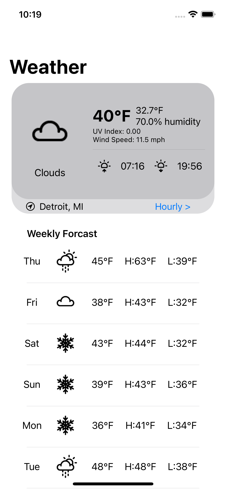
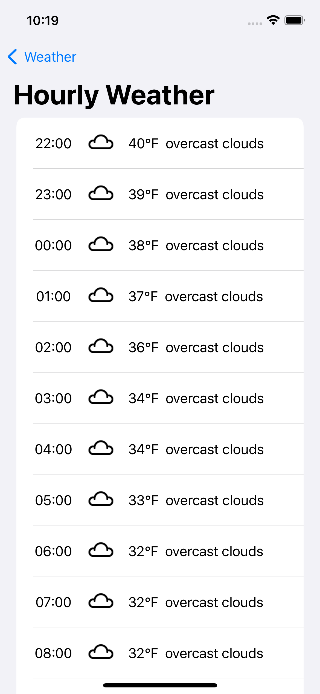
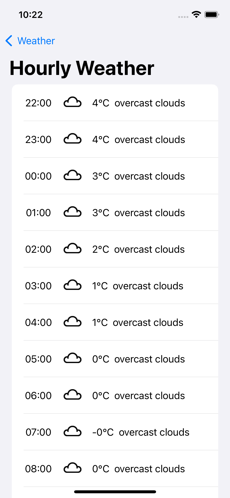
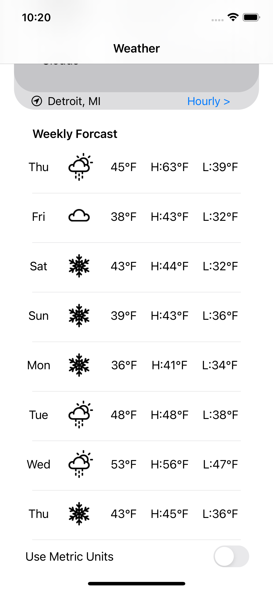
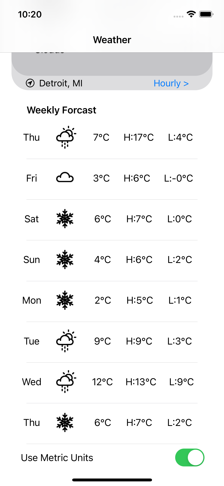

# ForcastME (SwiftUI Weather)

ForcastME is a Detroit Weather app built with Swift/SwiftUI.

The purpose of the app is to practice data modeling and API calls.
The API used in this project is [OpenWeather's One Call API](https://openweathermap.org/api/one-call-api).
- The API is packed full of information but I only selected a few key items that I thought I would enjoy.

The icons used for the app are from [Yorlmar Campos](https://iconstore.co/author/yorlmar-campos).
- I had trouble getting the icons from the OpenWeather site via a AsyncImage call so opted for these instead.

Both Metric and Imperial units are available for the user in the app.
- The unit toggle switch is at the bottom of the screen which isn't the most userfrienly/intuitive location.

My API key is NOT INCLUDED in the project. Additionally, the app is desinged for an iPhone 12/13 screen and doesn't dynamically adjust to other screens.

## ScreenShots

### Main Screen
 

The main screen takes a second to load up all the weather day (based on user's internet speed). The user is immediately shown the current weather information in a gray rectangle. This includes the weather condition, temperature, "feels-like" temperature, humidity, UV index, windspeed, the sunrise time, and the sunset time. The location is stated inthe bottom left. Additionally, the User can click on Hourly to see the hourly weather forecast or scroll down for the daily forecast.

### Hourly Weather Data
 

The hourly weather information includes the time, weather icon, temperature, and a breif description.

### Daily Weather Data
 

The daily weather infromation includes the day, weather icon, daily temperature, high temperature, and low temperature.

